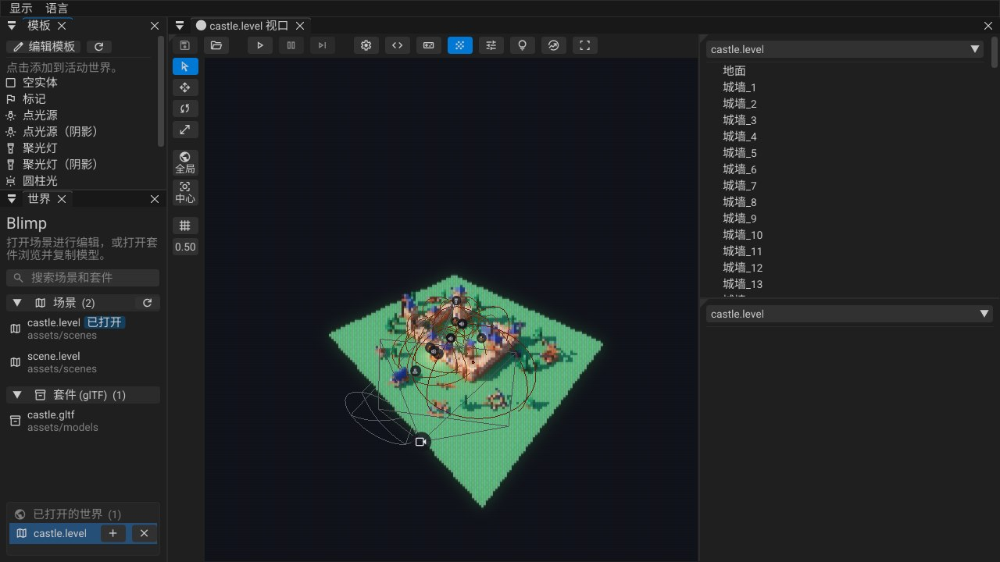
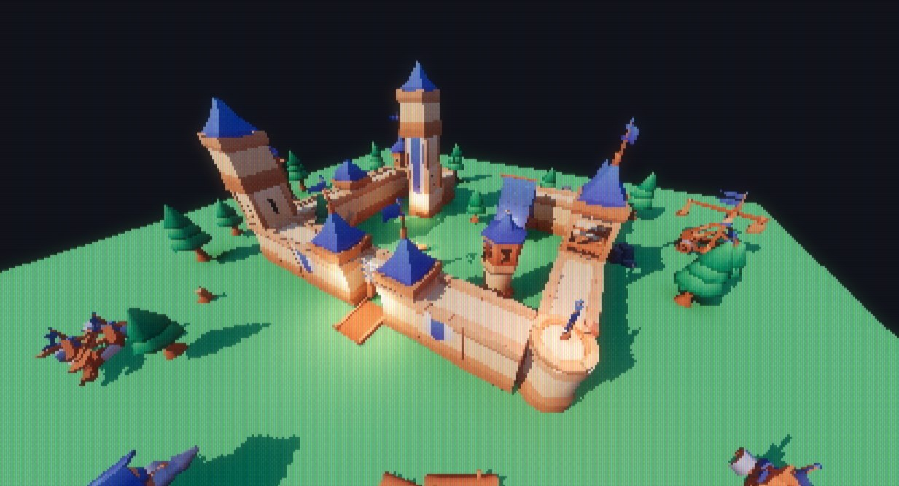
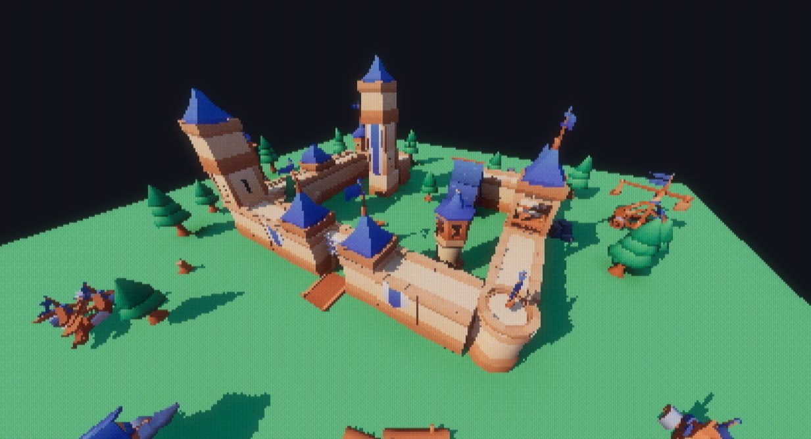
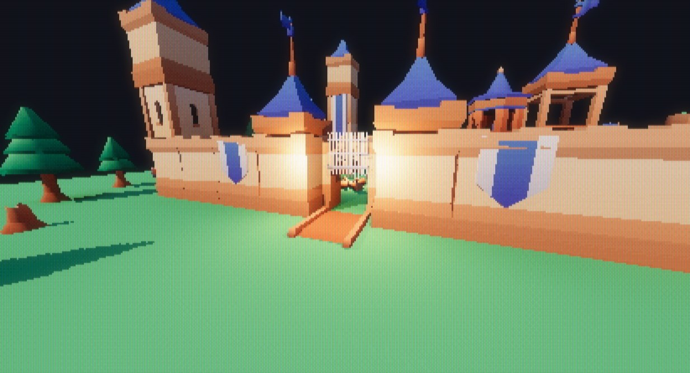
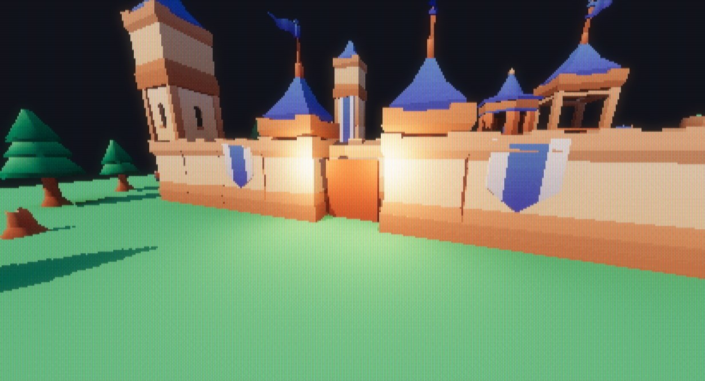
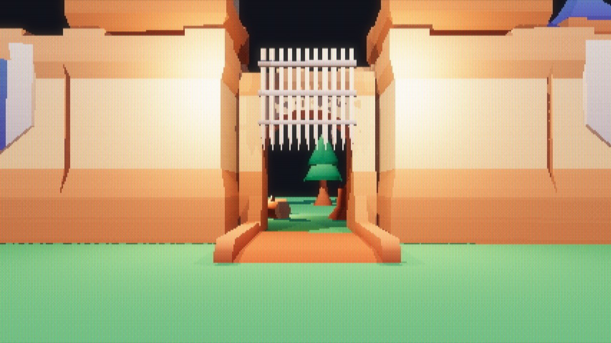

# Blimp 引擎 Lua 脚本指南

本文介绍怎样用 Lua 编写 Blimp 的游戏逻辑：脚本放在哪里、什么时候运行、能调用哪些引擎接口（实体、输入、移动与碰撞、声音、灯光组、相机），最后逐段讲解城堡关卡的脚本 `assets/scripts/castle.luacn`。

本文假设你已经会写 Lua，不讲 Lua 语言本身。引擎内嵌的是 **LuaJIT**（Lua 5.1 语法），矢量和四元数是 FFI 结构体。



---

## 1. 核心规则：Lua 发命令、查状态，不保存状态

这是整个脚本系统的前提，后面每个接口都按它设计：

- **游戏状态归引擎所有**。实体的位置、速度、声音都存在 Odin 那一侧；Lua 每帧读取它们，算出结果，再写回去。
- **脚本里不留会变的东西**。不要在脚本的全局或 upvalue 里存计时器、状态机、"上一帧的值"。顶层的 `本地` 只放常量（速度、半径、方向向量）。
- 需要随时间变化的东西，有两种写法：
  1. **写成时间的函数**：`世界.时间()` 是运行世界的游戏时钟，暂停时停止。城门、旗帜、探照灯都按 `世界.时间()` 算出当前姿态，不需要任何记忆。
  2. **存进实体字段**：例如玩家的竖直速度存在 `玩家` 实体的 `velocity` 字段里。字段不够用就在实体 schema 里加一个（见 [4.4](#44-自定义字段)）。

这样做的好处是：**脚本随时可以从头重新执行**。保存脚本时引擎热重载它，游戏不会因此坏掉。

---

## 2. 脚本文件与运行方式

### 2.1 两种脚本

| | 世界脚本 | 引擎脚本 |
|---|---|---|
| 文件 | 关卡的世界设置里的 `script` 路径，如 `assets/scripts/castle.lua` | 固定为 `assets/scripts/main.lua` |
| 何时运行 | 只在关卡**运行（Play）**时 | 引擎启动后整个会话 |
| 回调 | `世界.开始()`、`世界.更新(时间差)` | `引擎.开始()`、`引擎.更新(时间差)`、`引擎.完结()` |
| `世界.*` / `实体.*` 作用于 | 这个运行中的关卡 | 内部的 `game_world`（不渲染） |

**游戏逻辑写在世界脚本里。** 引擎脚本作用的 `game_world` 不在屏幕上，不是你正在玩的关卡。

每个世界脚本运行在自己的环境表里（找不到的名字回落到全局 `_G`），所以同时打开的两个关卡的脚本互不覆盖全局变量。脚本里的 `世界` 也是它自己的表，`世界.开始` 等回调只属于这个关卡。

### 2.2 LuaCN：中文关键字的 Lua

脚本可以写成 `.luacn`：关键字是中文，构建时（以及编辑器热重载时）转译成同名的 `.lua`。**关卡引用的是 `.lua`，但要改的是 `.luacn`**，生成的 `.lua` 会被覆盖。也可以直接写普通 `.lua`，所有接口都有英文名。

| LuaCN | Lua | LuaCN | Lua |
|---|---|---|---|
| `本地` | `local` | `返回` | `return` |
| `函数` | `function` | `结束` | `end` |
| `如果` / `那么` | `if` / `then` | `否则如果` / `否则` | `elseif` / `else` |
| `当` / `做` | `while` / `do` | `对于` / `在` | `for` / `in` |
| `重复` / `直到` | `repeat` / `until` | `中断` | `break` |
| `真` / `假` / `空` | `true` / `false` / `nil` | `和` / `或` / `非` | `and` / `or` / `not` |

常用标准库也有中文别名：`打印`(print)、`转文本`(tostring)、`转数字`(tonumber)、`遍历`(pairs)、`遍历列表`(ipairs)、`安全调用`(pcall)、`字符串.格式化`(string.format)、`表.插入`(table.insert) 等，完整列表在 `assets_engine/scripts/lua_chinese_defs.lua`。

### 2.3 给关卡挂脚本

1. 打开关卡，点视口工具栏上的齿轮按钮打开**世界设置**，在 `script` 里填脚本路径（项目相对路径，如 `assets/scripts/castle.lua`）。
2. 齿轮旁边的 `<>` 按钮用 VS Code 打开这个脚本；如果它是由 `.luacn` 生成的，打开的是 `.luacn`。
3. 按 **F5** 运行。

运行相关的功能键：

| 键 | 作用 |
|---|---|
| F5 | 运行：复制一份关卡来运行，脚本执行 `世界.开始()` |
| F6 | 暂停 / 继续。暂停时 `世界.更新` 不调用，`世界.时间()` 不走 |
| F10 | 暂停时单步一帧 |
| F7 | 停止。运行副本被丢弃，编辑中的关卡**从不**被运行修改 |
| F8 | 在游戏模式（整个窗口是游戏画面，通过相机实体看）和编辑器之间切换，游戏继续运行 |

运行的是关卡的**副本**：脚本把吊桥转了、把玩家移走了，停止后关卡还是原样，也不会被保存。

### 2.4 热重载与报错

- 运行时保存脚本，引擎会重新加载它，并**重新执行 `世界.开始()`**。因为脚本不保存状态，这总是安全的。
- 脚本出错时，错误写进日志，这个关卡的脚本停止运行，直到你修改脚本（热重载）或重新打开关卡。不会每帧刷屏。
- `打印(...)` 输出到引擎日志（控制台）。

---

## 3. 生命周期回调

```lua
function 世界.开始()
    -- 运行开始时执行一次（脚本热重载后也会再执行一次）
end

function 世界.更新(时间差)
    -- 关卡每走一帧调用一次；时间差 是这一帧的秒数
    本地 t = 世界.时间()   -- 自运行开始的游戏秒数，暂停时停止
end
```

英文写法是 `function World.start()` / `function World.update(dt)` / `World.time()`。

- `世界.更新` 只在关卡真正前进的帧调用：暂停时不调用，F10 单步时调用一次。
- 动画请基于 `世界.时间()`，不要在 Lua 里自己累加时间。

---

## 4. 实体

### 4.1 句柄

实体就是句柄。Lua 拿到的是一个整数，所有实体接口都以它为第一个参数。

| 中文 | 英文 | 说明 |
|---|---|---|
| `世界.查找(名称)` | `World.find(name)` | 按名称找实体，返回 `句柄, 是否找到` |
| `实体.有效(句柄)` | `Entity.valid(h)` | 句柄是否还指向一个存在的实体 |
| `世界.添加(名称, 模型, 位置)` | `World.add(name, model, pos)` | 新建实体，返回句柄。`模型` 是资产键，如 `"assets/models/castle.gltf:flag001"`；名称重复时自动改成 `name_1` 这样的唯一名 |
| `世界.移除(句柄)` | `World.remove(h)` | 删除实体 |

名称可以是中文（城堡关卡的实体全是中文名），按 UTF-8 存储，最长 64 字节，约 21 个汉字。

`世界.查找` 很便宜，每帧按名称查找就是推荐写法，不要把句柄缓存在脚本里。找不到时句柄无效，`实体.有效` 返回假，后续对它的读写都是安全的空操作：

```lua
本地 灯 = 世界.查找("探照灯")
如果 非 实体.有效(灯) 那么 返回 结束
```

> 运行中用 `世界.添加` 生成的实体目前不参与碰撞（物理世界在运行开始时建好）。

### 4.2 读写字段

实体是一个"胖结构体"，所有字段都按名称读写。接口按值的类型区分：

| 类型 | 读 | 写 | 适用字段 |
|---|---|---|---|
| 数字 | `实体.取数(e, 字段)` | `实体.设数(e, 字段, 值)` | `f32`、整数、枚举（序号）、标志位（位掩码） |
| 布尔 | `实体.取布尔(e, 字段)` | `实体.设布尔(e, 字段, 值)` | `bool` |
| 文本 | `实体.取文本(e, 字段)` | `实体.设文本(e, 字段, 值)` | 名称、模型、声音等字符串 |
| 矢量 | `实体.取矢量(e, 字段)` | `实体.设矢量(e, 字段, 矢量3)` | `vec3` |
| 四元数 | `实体.取四元数(e, 字段)` | `实体.设四元数(e, 字段, 四元数)` | `quat` |

英文名：`Entity.get_number / set_number / get_bool / set_bool / get_string / set_string / get_vec3 / set_vec3 / get_quat / set_quat`。

字段名用 schema 里的**英文 id**（编辑器检查器里显示的是中文标签）。字段名写错或类型不对时，读返回零值，写不生效。

```lua
本地 门 = 世界.查找("闸门")
本地 位置 = 实体.取矢量(门, "position")
实体.设矢量(门, "position", 矢量3(位置.x, 0.6, 位置.z))
实体.设数(世界.查找("主塔火把"), "intensity", 2.0)
```

### 4.3 常用字段

| 字段 | 类型 | 说明 |
|---|---|---|
| `name` | 文本 | 名称，在一个关卡里唯一 |
| `position` / `rotation` / `scale` | 矢量 / 四元数 / 矢量 | 变换 |
| `model` | 文本 | 模型资产键 |
| `basic_flags` | 标志 | 位 0 = 启用（Enabled），位 1 = 隐藏（Hidden） |
| `basic_static_flags` | 标志 | 位 0 = 静态（Static），位 1 = 可渲染（Renderable），位 2 = 投射间接光（Cast Indirect） |
| `camera_type` | 枚举 | 0 无，1 透视，2 正交 |
| `light_type` | 枚举 | 0 无，1 平行光，2 点光源，3 聚光灯，4 圆柱光 |
| `color` / `intensity` | 矢量 / 数字 | 灯光颜色与强度 |
| `fov` / `inner_fov` | 数字 | 相机视角；聚光灯外 / 内锥角（度） |
| `range` | 矢量（x, y） | 灯光：照射范围；声音：x 以内满音量，到 y 线性衰减为零 |
| `light_group` | 数字 | 灯光所属的光源组，0 = 不可切换（见第 8 节） |
| `sound` / `volume` / `sound_flags` | 文本 / 数字 / 标志 | 实体自带的声音（见第 7 节） |
| `collision` | 枚举 | 0 无，1 包围盒，2 碰撞网格（`_col`），3 渲染网格 |
| `velocity` | 矢量 | 游戏自用的速度，不保存到关卡文件 |

标志位按位掩码读写，例如隐藏一个实体：

```lua
本地 标志 = 实体.取数(e, "basic_flags")       -- 1 = 只启用
实体.设数(e, "basic_flags", 标志 + 2)          -- 加上 Hidden（假设原来没有隐藏）
```

**会被脚本移动的实体不要勾"静态"**。静态实体参与探针烘焙，也是物理里的静态刚体；城堡里的吊桥、闸门、旗帜都只设了 Renderable。

### 4.4 自定义字段

字段定义在项目根目录的 `entity_schema.ini`（也可以用引擎内的 schema 编辑器修改），构建时生成 `src/gen_entity.odin`。新加的字段**不需要重新生成任何绑定**，Lua 立即可以按名称读写。城堡玩家用的 `velocity` 就是这样一个游戏字段。

---

## 5. 数学库

| 中文 | 英文 | |
|---|---|---|
| `矢量2/3/4(x, y, …)` | `Vec2/3/4` | 支持 `+ - *`（与数字或同类相乘）、取负；方法 `:点乘 :叉乘 :长度 :标准化 :插值` |
| `四元数(x, y, z, w)` | `Quat` | `四元数.单位()`、`四元数.轴角(轴, 弧度)`、`四元数.欧拉角(俯仰, 偏航, 滚转)`；方法 `:旋转(矢量) :球面插值 :逆 :共轭 :标准化` |
| `矩阵3` / `矩阵4` | `Mat3` / `Mat4` | `矩阵4.变换矩阵(位置, 旋转, 缩放)`、`:变换点 :变换方向 :逆矩阵` 等 |
| `数学.*` | `CMath.*` | `圆周率 正弦 余弦 反正切2 反正弦 开方 夹紧 截断(0–1) 插值 平滑阶跃 向下取整 角度转弧度 …` |

- 四元数相乘 `a * b` 表示先做 `b` 再做 `a`（相对本地坐标）。城堡里 `四元数.轴角(上, 偏航) * 四元数.轴角(右, 俯仰)` 是先抬头低头、再左右转。
- `四元数:旋转(矢量)` 把向量转到这个朝向下，例如 `朝向:旋转(矢量3(0, 0, 1))` 是朝前的方向。
- 角度一律是**弧度**。

**坐标系**：左手系，**Y 向上，+Z 向前**，+X 向右。

---

## 6. 输入

输入只在**游戏模式**下、窗口有焦点时有效（运行后，或按 F8 进入）。在编辑器里打字不会传进游戏；不在游戏模式时所有按键读作松开、所有轴读作 0。

| 中文 | 英文 | 说明 |
|---|---|---|
| `输入.按住(键)` | `Input.down(key)` | 现在是否按着 |
| `输入.按下(键)` | `Input.pressed(key)` | 这一帧刚按下 |
| `输入.松开(键)` | `Input.released(key)` | 这一帧刚松开 |
| `输入.鼠标按住(n)` / `输入.鼠标按下(n)` | `Input.mouse_down / mouse_pressed` | 鼠标键 1–5：1 左键，2 中键，3 右键 |
| `输入.鼠标移动()` | `Input.mouse_delta()` | 这一帧鼠标移动的像素（矢量2，+y 向下），锁定鼠标时也有效 |
| `输入.锁定鼠标(布尔)` | `Input.lock_mouse(b)` | 隐藏光标并锁在窗口内（鼠标视角）。回到编辑器时自动放开，回到游戏时重新锁定 |
| `输入.手柄轴(名称)` | `Input.gamepad_axis(name)` | 摇杆 −1 到 1（+y 向下，已去死区），扳机 0 到 1；无手柄时为 0 |
| `输入.手柄按住(名称)` / `输入.手柄按下(名称)` | `Input.gamepad_down / gamepad_pressed` | 手柄按键 |

键名是 SDL 的扫描码名：`"W"`、`"Space"`、`"Escape"`、`"Left Shift"`、`"Return"`、`"Up"`……
手柄名是 SDL 的手柄名：轴 `"leftx" "lefty" "rightx" "righty" "lefttrigger" "righttrigger"`，按键 `"a" "b" "x" "y" "leftstick" "start"`……

---

## 7. 声音

声音文件（`.wav .ogg .mp3 .flac`）在启动时全部解码，用项目路径作为键，例如 `"assets/sounds/jump.wav"`。Lua 拿不到声音句柄：**要控制的声音就挂在实体上，实体就是句柄。**

### 7.1 实体上的声音

在编辑器里给实体设置：

- `sound`：声音文件；`volume`：音量；
- `sound_flags`：**开始时播放**（运行开始自动播放）、**循环**、**空间定位**；
- `range`：x 以内满音量，到 y 线性衰减为零。

| 中文 | 英文 | 说明 |
|---|---|---|
| `实体.播放声音(e)` | `Entity.play_sound(e)` | 按这个实体的 sound / volume / range / sound_flags 播放，声音跟着实体移动。没播出来返回假 |
| `实体.停止声音(e)` | `Entity.stop_sound(e)` | 停止它的声音 |

### 7.2 一次性声音

| 中文 | 英文 | 说明 |
|---|---|---|
| `世界.播放声音(键 [, 音量])` | `World.play_sound(key [, volume])` | 不在空间中的声音：音乐、界面音效，哪里听都一样大 |
| `世界.在位置播放声音(键, 位置 [, 音量])` | `World.play_sound_at(key, pos [, volume])` | 在某一点播放，按默认范围随距离衰减 |

注意：

- 同时最多 32 个声音。满了以后挤掉听起来最小的；新声音比所有正在播放的都小时直接丢弃。
- 同一个声音文件 0.05 秒内只会响一次（循环声音除外），每帧调用播放不会叠成噪音，但也不会每帧都响。
- 听者是正在显示运行世界的那个视口的相机（游戏模式下就是游戏相机）。
- 暂停时声音暂停，停止运行时全部停止。编辑中的关卡不发声。

---

## 8. 灯光组

灯光组用来在运行时整体调节一批灯：停电、蜡烛闪烁、窗户的灯一开一关。

- 每个关卡最多 **4 个**可切换的组，在**世界设置 → 光源组**里命名，并设置初始强度 `scale` 和闪烁图案 `pattern`。
- 每盏灯的 `light_group` 字段指定它属于哪个组（1–4）。0 组永远满强度。
- 组的强度同时作用于这些灯的**实时直接光**和**烘焙的间接光**（每个组烘焙在探针的独立一层），所以关灯后墙上的反光也一起消失。
- `pattern` 是 Quake 风格的灯光图案：每个字母持续 0.1 秒，循环；`a` = 0，`m` = 1，`z` ≈ 2；留空表示常亮。城堡的火把组用的是 `mmnmmommommnonmmonqnmmo`。

| 中文 | 英文 | 说明 |
|---|---|---|
| `世界.设光源组(名称, 强度)` | `World.set_light_group(name, scale)` | 0 = 关，1 = 和保存/烘焙时一样。没有这个名称的组时返回假 |
| `世界.光源组(名称)` | `World.light_group(name)` | 当前强度（不含闪烁图案） |

名称不区分大小写。最终亮度 = 组强度 × 闪烁图案当前的值，所以对火把组调用 `世界.设光源组("torches", 0.5)` 后它仍然闪烁，只是整体暗了一半。脚本设置的强度只属于这次运行，不会保存。

| 所有组 = 1 | 所有组 = 0 |
|---|---|
|  |  |

上图是城堡关卡把 `torches`、`beacon`、`windows` 三组全开和全关的对比：城门两侧的火把、右侧角楼的信标和庭院里的篝火都熄灭了，只剩平行光 `sun` 和探照灯（都在 0 组）。

---

## 9. 移动与碰撞

物理目前只提供**查询**：不做模拟，没有刚体下落。"东西怎么掉"由 Lua 自己决定（重力写进位移里）。

### 9.1 哪些实体会挡路

运行开始时，引擎给每个启用、且 `collision` 不为"无"的实体建一个碰撞体：

| `collision` | 形状 | 适合 |
|---|---|---|
| 无 | 不碰撞 | 旗子、装饰小物 |
| 包围盒 | 模型包围盒 × 缩放 | 树、石头，最便宜 |
| 碰撞网格（默认） | 套件里的 `<模型>_col` 网格 | 美术专门做了简化碰撞的模型 |
| 渲染网格 | 模型的所有三角形 | 低多边形的城墙、地面 |

勾了"静态"的实体是静态碰撞体；其他的会**跟着实体移动**——脚本转动吊桥，玩家就会被吊桥挡住。

### 9.2 角色移动

```lua
本地 着地 = 实体.角色移动(e, 位移, 半径, 高度)   -- Entity.move_character(e, delta, radius, height)
```

给玩家、NPC 这类在场景里走动的角色用。引擎用物理（Box3D）把实体当成一个站在它 `position` 上的胶囊体（半径、总高度），移动 `位移`，沿碰撞面滑动：撞墙停下，斜坡和台阶会走上去。结果直接写进实体的 `position`。返回值表示结束时是否站在地面上（法线 y ≥ 0.7 的面算地面）。实体自己的碰撞体会被忽略。

只想直接改位置、不需要碰撞（吊桥、闸门、旗帜）就直接设 `position` / `rotation` 字段。

位移已经乘过 `时间差`；重力也是位移的一部分。速度要跨帧保留就存进实体字段（见第 10 节玩家的写法）。

### 9.3 射线检测

```lua
本地 命中, 点, 法线, 实体号 = 世界.射线检测(起点, 方向, 距离)   -- World.raycast(origin, dir, dist)
```

沿射线找第一个碰撞（方向不必是单位向量），返回是否命中、命中点、表面法线和命中的实体句柄。

---

## 10. 相机

游戏画面通过运行世界里**第一个启用的相机实体**（`camera_type` 不为"无"）来渲染。控制相机就是写它的 `position` 和 `rotation`，和任何实体一样。

城堡的 `主相机` 在关卡里摆成编辑器的俯瞰视角；脚本在 `世界.开始()` 里把它转到玩家的朝向，之后每帧放到玩家眼睛的位置。

---

## 11. 调试

- `打印(...)` 输出到引擎日志。
- 调试版引擎可以用 `bin/blimpctl.exe` 从命令行执行 Lua：

  ```
  blimpctl worlds                      # 列出世界，运行副本的序号在这里
  echo print(World.time()) | blimpctl lua 1 -
  ```

  `lua <世界> -` 让 `World.*` / `Entity.*` 作用于指定的世界，适合在运行中的关卡里测试射线、声音、灯光组。例如在城堡的运行副本里从玩家眼睛向前打一条射线：

  ```
  local p = World.find("玩家")
  local hit, pt, n, e = World.raycast(Entity.get_vec3(p, "position") + Vec3(0, 0.34, 0), Vec3(0, 0, 1), 8)
  print(hit, Entity.get_string(e, "name"), pt)
  -- true    小树_1    Vec3(-2.98023e-08, 0.335, 1.60769)
  ```

- 暂停（F6）后可以用 `blimpctl lua` 改实体、改灯光组，画面立即反映，而脚本不会把它覆盖回去，因为暂停时 `世界.更新` 不运行。

---

## 12. 示例：城堡关卡

`assets/scenes/castle.level` 的世界设置里 `script = assets/scripts/castle.lua`，它由 `assets/scripts/castle.luacn` 生成。脚本做了六件事：城门开关、城门音效、探照灯扫动、旗帜飘动、灯光组变化，以及一个第一人称玩家。所有动画都只是 `世界.时间()` 的函数；唯一跨帧的状态（玩家的竖直速度）存在实体字段里。

### 12.1 常量与工具函数

```lua
本地 上 = 矢量3(0, 1, 0)
本地 右 = 矢量3(1, 0, 0)
本地 前 = 矢量3(0, 0, 1)

本地 函数 平滑(x)
    x = 数学.截断(x)
    返回 x * x * (3 - 2 * x)
结束
```

顶层只有常量和纯函数。`平滑` 是 0–1 的 smoothstep 缓动。

### 12.2 城门：用时间算出姿态

```lua
-- 城门循环，0 = 关闭并升起，1 = 打开并放下：开 6 秒，关闭 2 秒，关 5 秒，打开 2 秒。
本地 函数 城门开度(t)
    本地 p = t % 15
    如果 p < 6  那么 返回 1 结束
    如果 p < 8  那么 返回 1 - 平滑((p - 6) / 2) 结束
    如果 p < 13 那么 返回 0 结束
    返回 平滑((p - 13) / 2)
结束

本地 函数 更新城门(t)
    本地 开度 = 城门开度(t)
    本地 朝向 = 四元数.轴角(上, 数学.圆周率 / 2)   -- 城门朝 -Z（它的套件部件偏航了 90 度）

    -- 吊桥：铰链在原点，沿本地 +X 平放；升起时绕本地 Z 把 +X 往上转。
    本地 吊桥 = 世界.查找("吊桥")
    如果 实体.有效(吊桥) 那么
        实体.设四元数(吊桥, "rotation", 朝向 * 四元数.轴角(前, (1 - 开度) * 数学.角度转弧度(80)))
    结束

    -- 闸门：城门打开时从拱门里升起（在吊桥放下之前先升）。
    本地 闸门 = 世界.查找("闸门")
    如果 实体.有效(闸门) 那么
        本地 位置 = 实体.取矢量(闸门, "position")
        实体.设矢量(闸门, "position", 矢量3(位置.x, 平滑(开度 * 1.5) * 0.6, 位置.z))
    结束
结束
```

要点：

- `城门开度(t)` 是一个 15 秒循环的纯函数。任意时刻（包括热重载之后、单步之后）都能直接算出城门该在哪，不需要"当前状态"变量。
- 吊桥的旋转 = 基础朝向 × 绕本地 Z 的抬起角度。四元数右乘表示在本地坐标里旋转。
- 闸门只改 `position.y`，x、z 从实体上读出来原样写回。
- 吊桥和闸门的 `collision` 不为"无"、也不是静态，所以物理碰撞体跟着它们动：吊桥升起时玩家走不过去。

| 打开（t % 15 < 6） | 关闭（8 ≤ t % 15 < 13） |
|---|---|
|  |  |

### 12.3 城门音效：检测"越过"某个时刻

```lua
-- 越过 = 这一帧越过了 间隔 的整数倍。
本地 函数 越过(t, 时间差, 间隔)
    返回 数学.向下取整(t / 间隔) ~= 数学.向下取整((t - 时间差) / 间隔)
结束

本地 函数 更新城门声音(t, 时间差)
    如果 越过(t - 6, 时间差, 15) 或 越过(t - 13, 时间差, 15) 那么   -- 开始关闭 / 开始打开
        实体.播放声音(世界.查找("城门声"))
    结束
结束
```

不保存"上次播放的时间"，而是比较这一帧的开始和结束是否跨过了 6 秒、13 秒这两个节点。`城门声` 是放在城门处的一个空实体，它的 `sound = assets/sounds/gate.wav`、`sound_flags = 空间定位`、`range = 0.5, 10`，脚本只管"现在播"，怎么播由实体字段决定。

### 12.4 探照灯与旗帜

```lua
本地 函数 更新探照灯(t)
    本地 灯 = 世界.查找("探照灯")
    如果 非 实体.有效(灯) 那么 返回 结束
    本地 偏航 = 数学.圆周率 + 数学.正弦(t * 0.5) * 数学.角度转弧度(70)
    实体.设四元数(灯, "rotation", 四元数.轴角(上, 偏航) * 四元数.轴角(右, 数学.角度转弧度(38)))
结束

本地 函数 更新旗帜(t)
    本地 i = 1
    当 真 做
        本地 旗 = 世界.查找("旗帜_" .. i)
        如果 非 实体.有效(旗) 那么 中断 结束
        本地 摆动 = 数学.正弦(t * 2.3 + i * 1.7) * 0.35 + 数学.正弦(t * 5.1 + i) * 0.08
        实体.设四元数(旗, "rotation", 四元数.轴角(上, 摆动))
        i = i + 1
    结束
结束
```

- 探照灯是一个投射阴影的聚光灯实体，转它的 `rotation` 就是转光束：先向下俯 38°，再左右扫 ±70°。
- 旗帜按命名约定 `旗帜_1`、`旗帜_2`……逐个查找，直到找不到为止。在编辑器里多复制一面旗（复制会自动编号）脚本就会让它一起飘，不用改代码。每面旗的相位 `i * 1.7` 不同，所以不会整齐划一。

### 12.5 灯光组

```lua
-- 光源组（世界设置）：信标闪烁，大厅的窗户每 20 秒里暗 4 秒。
本地 函数 更新灯光(t)
    世界.设光源组("beacon", 0.55 + 0.45 * 数学.正弦(t * 3))
    世界.设光源组("windows", (t % 20) < 16 和 1 或 0)
结束
```

城堡的世界设置里有三个组：`torches`（火把，带闪烁图案）、`beacon`（城门塔上的信标）、`windows`（大厅窗户）。火把的闪烁完全由图案完成，脚本不用管；信标用正弦做呼吸效果；窗户每 20 秒熄灭 4 秒。因为组强度也作用于烘焙的间接光，窗户熄灭时它照在庭院里的反光也会消失。

### 12.6 第一人称玩家

`玩家` 是一个没有模型的实体，代表站在它 `position` 上的胶囊；`主相机` 每帧跟到它的眼睛处。



**视角：从相机现在的朝向反推偏航和俯仰。** 脚本不存"当前偏航角"，而是每帧从相机的 `rotation` 算出来，加上这一帧的鼠标 / 右摇杆输入：

```lua
本地 朝前 = 实体.取四元数(相机, "rotation"):旋转(前)
本地 鼠标 = 输入.鼠标移动()
本地 偏航 = 数学.反正切2(朝前.x, 朝前.z) + 鼠标.x * 灵敏度 + 输入.手柄轴("rightx") * 摇杆看速 * 时间差
本地 俯仰 = -数学.反正弦(数学.夹紧(朝前.y, -1, 1)) + 鼠标.y * 灵敏度 + 输入.手柄轴("righty") * 摇杆看速 * 时间差
俯仰 = 数学.夹紧(俯仰, -1.4, 1.4)
本地 朝向 = 四元数.轴角(上, 偏航) * 四元数.轴角(右, 俯仰)
```

**移动：键盘和左摇杆合成一个方向。**

```lua
本地 向前 = 矢量3(数学.正弦(偏航), 0, 数学.余弦(偏航))
本地 向右 = 矢量3(数学.余弦(偏航), 0, -数学.正弦(偏航))
本地 前后 = -输入.手柄轴("lefty")
本地 左右 = 输入.手柄轴("leftx")
如果 输入.按住("W") 那么 前后 = 前后 + 1 结束
如果 输入.按住("S") 那么 前后 = 前后 - 1 结束
如果 输入.按住("D") 那么 左右 = 左右 + 1 结束
如果 输入.按住("A") 那么 左右 = 左右 - 1 结束
-- （长度超过 1 时归一化，按住左 Shift / 按下左摇杆时用跑速）
本地 水平 = (向前 * 前后 + 向右 * 左右) * 速度
```

**重力、跳跃与碰撞：竖直速度存在实体字段里。**

```lua
本地 竖直 = 实体.取矢量(玩家, "velocity").y - 重力 * 时间差
本地 着地 = 实体.角色移动(玩家, 矢量3(水平.x * 时间差, 竖直 * 时间差, 水平.z * 时间差), 玩家半径, 玩家身高)
如果 着地 和 竖直 < 0 那么 竖直 = -0.1 结束          -- 轻轻压住地面，下一帧还算着地
如果 着地 和 (输入.按下("Space") 或 输入.手柄按下("a")) 那么
    竖直 = 跳速
    世界.播放声音("assets/sounds/jump.wav", 0.5)
结束
实体.设矢量(玩家, "velocity", 矢量3(0, 竖直, 0))
```

这里是"Lua 不保存状态"的标准写法：读字段 → 计算 → `实体.角色移动` → 写回字段。速度在 `玩家` 实体上，脚本热重载后玩家照样在空中继续下落。

**相机跟随、出界复位、脚步声：**

```lua
本地 位置 = 实体.取矢量(玩家, "position")
如果 位置.y < -5 那么   -- 掉出了世界：回到出生点
    位置 = 出生点
    实体.设矢量(玩家, "position", 位置)
    实体.设矢量(玩家, "velocity", 矢量3(0, 0, 0))
结束
本地 眼 = 位置 + 上 * 眼高
实体.设矢量(相机, "position", 眼)
实体.设四元数(相机, "rotation", 朝向)

-- 在地上走动时每 步距时间 一步，跑时按速度加快。
如果 着地 和 长 > 0.1 和 越过(t, 时间差, 步距时间 * 走速 / 速度) 那么
    世界.在位置播放声音("assets/sounds/footstep.wav", 位置, 0.7)
结束
```

脚步声复用了 12.3 节的 `越过`：每跨过一个步距就响一声，不需要计步器。

**射线检测：按 E / 手柄 X 沿视线打一条 8 单位的射线。**

```lua
如果 输入.按下("E") 或 输入.手柄按下("x") 那么
    本地 命中, 点, 法线, 实体号 = 世界.射线检测(眼, 朝向:旋转(前), 8)
    如果 命中 那么
        世界.在位置播放声音("assets/sounds/ping.wav", 点)
        打印("射线命中 " .. 实体.取文本(实体号, "name") .. " " .. 转文本(点))
    结束
结束
```

### 12.7 回调

```lua
函数 世界.开始()
    打印("castle.luacn: 开始")
    -- 相机从玩家的朝向开始（关卡里的 主相机 是编辑器里的俯瞰视角）。
    本地 玩家 = 世界.查找("玩家")
    本地 相机 = 世界.查找("主相机")
    如果 实体.有效(玩家) 和 实体.有效(相机) 那么
        实体.设四元数(相机, "rotation", 实体.取四元数(玩家, "rotation"))
        输入.锁定鼠标(真)
    结束
结束

函数 世界.更新(时间差)
    本地 t = 世界.时间()
    更新城门(t)
    更新城门声音(t, 时间差)
    更新探照灯(t)
    更新旗帜(t)
    更新灯光(t)
    更新玩家(t, 时间差)
结束
```

`世界.更新` 只是按顺序调用各个系统，每个系统自己查找实体、读写字段。这和引擎本身"每帧几趟线性循环"的结构一致。

操作方式：WASD / 左摇杆走，左 Shift / 按下左摇杆跑，鼠标 / 右摇杆看，空格 / A 跳，E / X 射线检测，Esc 放开鼠标，左键再锁定。

---

## 附录：接口速查

| 中文 | 英文 | 参数 → 返回 |
|---|---|---|
| **世界** | | |
| `世界.开始` / `世界.更新` | `World.start` / `World.update` | 由脚本定义的回调；`更新(时间差)` |
| `世界.时间()` | `World.time()` | → 运行以来的游戏秒数 |
| `世界.查找(名称)` | `World.find(name)` | → 句柄, 是否找到 |
| `世界.添加(名称, 模型, 位置)` | `World.add(name, model, pos)` | → 句柄 |
| `世界.移除(句柄)` | `World.remove(h)` | |
| `世界.射线检测(起点, 方向, 距离)` | `World.raycast(o, d, dist)` | → 命中, 点, 法线, 句柄 |
| `世界.播放声音(键 [, 音量])` | `World.play_sound(key [, vol])` | → 是否播放 |
| `世界.在位置播放声音(键, 位置 [, 音量])` | `World.play_sound_at(key, pos [, vol])` | → 是否播放 |
| `世界.设光源组(名称, 强度)` | `World.set_light_group(name, s)` | → 是否有这个组 |
| `世界.光源组(名称)` | `World.light_group(name)` | → 强度 |
| **实体** | | |
| `实体.有效(e)` | `Entity.valid(e)` | → 布尔 |
| `实体.取数 / 设数` | `Entity.get_number / set_number` | `(e, 字段 [, 值])` |
| `实体.取布尔 / 设布尔` | `Entity.get_bool / set_bool` | `(e, 字段 [, 值])` |
| `实体.取文本 / 设文本` | `Entity.get_string / set_string` | `(e, 字段 [, 值])` |
| `实体.取矢量 / 设矢量` | `Entity.get_vec3 / set_vec3` | `(e, 字段 [, 矢量3])` |
| `实体.取四元数 / 设四元数` | `Entity.get_quat / set_quat` | `(e, 字段 [, 四元数])` |
| `实体.角色移动(e, 位移, 半径, 高度)` | `Entity.move_character(e, delta, r, h)` | → 是否着地 |
| `实体.播放声音(e)` / `实体.停止声音(e)` | `Entity.play_sound / stop_sound` | → 是否播放 / 无 |
| **输入** | | |
| `输入.按住 / 按下 / 松开(键)` | `Input.down / pressed / released` | → 布尔 |
| `输入.鼠标按住 / 鼠标按下(n)` | `Input.mouse_down / mouse_pressed` | → 布尔 |
| `输入.鼠标移动()` | `Input.mouse_delta()` | → 矢量2 |
| `输入.锁定鼠标(布尔)` | `Input.lock_mouse(b)` | |
| `输入.手柄轴(名称)` | `Input.gamepad_axis(name)` | → 数字 |
| `输入.手柄按住 / 手柄按下(名称)` | `Input.gamepad_down / gamepad_pressed` | → 布尔 |
| **引擎**（`main.lua`） | | |
| `引擎.开始 / 更新 / 完结` | `Blimp.start / update / finish` | 由 main.lua 定义的会话级回调 |
